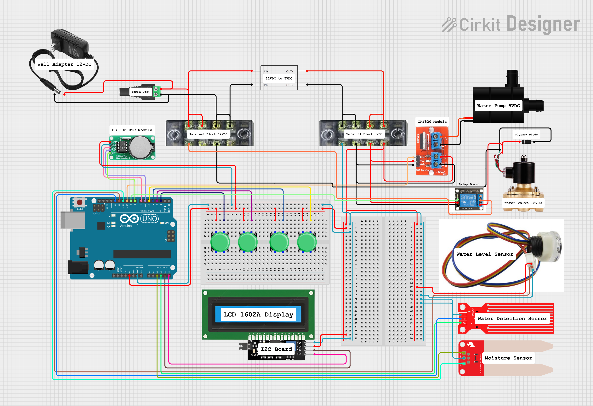
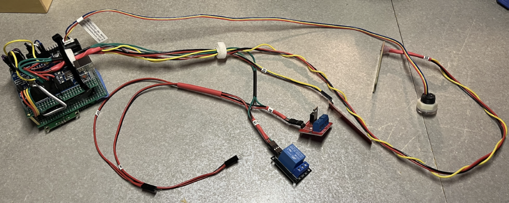
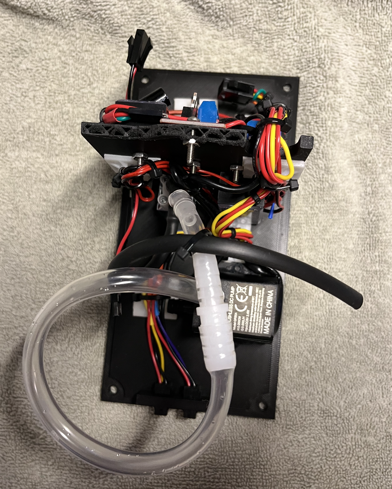
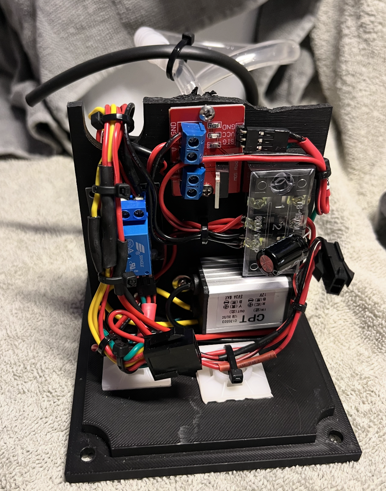

# AutoWaterPump 🌱💧

An Arduino-based automatic plant watering system with smart monitoring, scheduling, and manual control features.

## 📋 Overview

The AutoWaterPump is an intelligent plant watering system built on Arduino Uno that monitors soil moisture levels and automatically waters plants based on configurable schedules and thresholds. It features an LCD display, menu system, and multiple sensors to ensure optimal plant care.

In this project, I focused on the hardware side. I learned soldering, reading and designing electrical schematics, working with sensor channels, and building stable circuits on perfboards. I also learned so much more on saving and managing memory through little things like using the right data types.

Learning computer architecture and assembly language helped me understand how to optimize the code for better performance and memory usage. This project was a great way to apply those concepts in a practical setting. (I learned how to [disassemble LC4 object files](https://gitfront.io/r/quiyetbrul/hrpHZyirTkfn/lc4-disassembler/) using C, converting machine code back into human-readable assembly instructions.)

## ✨ Features

### 🤖 Automatic Watering

- **Smart scheduling**: Set custom watering intervals (hours)
- **Soil moisture monitoring**: Real-time soil moisture detection
- **Water level detection**: Prevents dry pumping
- **Pump control**: Automatically activates water pump based on moisture levels

### 📱 User Interface

- **16x2 LCD Display**: Clear status and menu navigation
- **4-button control**: Easy navigation and settings
- **Multiple menu pages**: Auto watering, manual control, settings, calibration

### 🔧 Manual Control

- **Manual watering mode**: Override automatic system
- **Real-time monitoring**: View sensor readings during operation

### 🕒 Real-Time Clock Integration

- **Scheduled watering**: Time-based watering schedules
- **Timing precision**: Accurate interval tracking

## 🔌 Hardware Requirements

### 🔗 Wiring Diagram

## 📸 Other Assets to Look At :D

## Happy Gardening! 🌿
